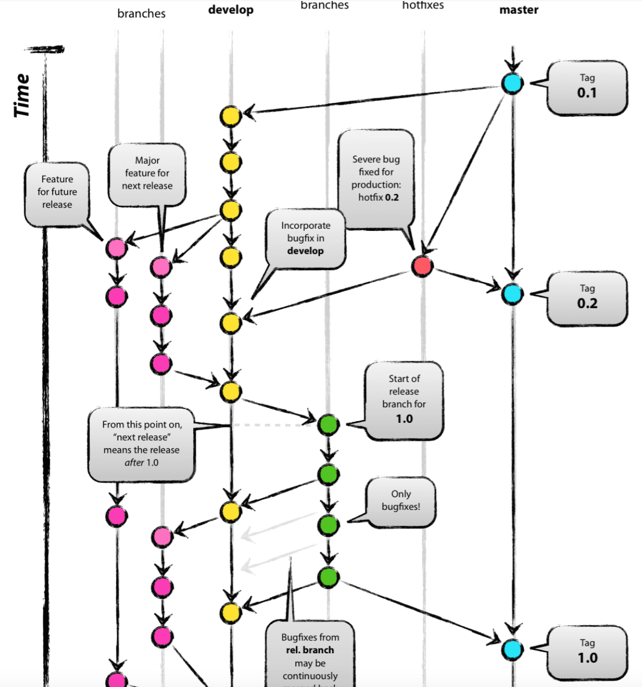
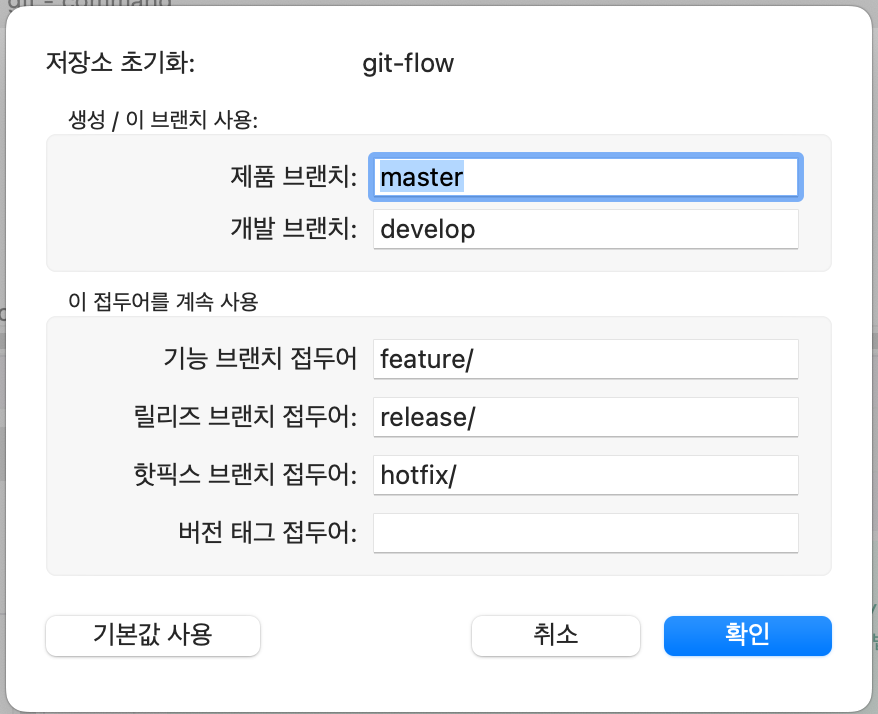

# GitFlow

Git-flow 전략

Git-flow에는 5가지 종류의 브랜치가 있다.. 항상 유지되는 메인 브랜치들(master, develop)과 일정 기간 동안만 유지되는 보조 브랜치들(feature, release, hotfix)이 있다.

* master : 제품으로 출시될 수 있는 브랜치
* develop : 다음 출시 버전을 개발하는 브랜치
* feature : 기능을 개발하는 브랜치
* release : 이번 출시 버전을 준비하는 브랜치
* hotfix : 출시 버전에서 발생한 버그를 수정 하는 브랜치

## SourceTree에서 설정
1. 저장소 - Git flow /Hg flow - 저장소 초기화

2. 저장소 초기화를 클릭 후  master/develop 으로 선택하면된다

3. feature 브랜치 생성 
   * 저장소  - Git flow /Hg flow - 새기능시작
   * feature브랜치가 생성된다. 
   * 기능을 마무리했으면 기능마무리 클릭
   * develop과 merge하면된다
