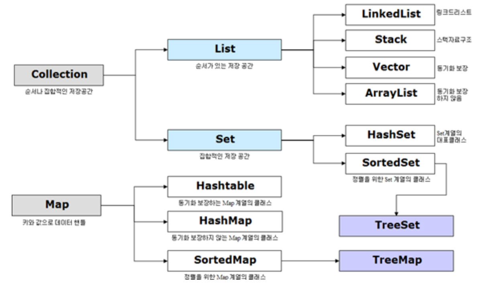

# Java - Collection
Java에서 컬렉션(Collection)이란 데이터의 집합, 그룹을 의미하며 

JCF(Java Collections Framework)는 이러한 데이터, 자료구조인 컬렌션과 이를 구현하는 클래스를 정의하는 인터페이스를 제공한다.
* Java 컬렌션 프레임워크의 상속구조
   * 

* Collection 인터페이스는 List, Set, Queue로 크게 3가지 상위 인터페이스로 분류할 수 있다.
* Map의 경우 Collection 인터페이스를 상속받고 있지 않지만 Collection으로 분류된다 

### 📌 Collection 인터페이스의 특징

| 인터페이스      |  구현 클래스   |  특징 |
| ---------- | ------------- | -----|
| Set | HashSet   TreeSet | 순서를 유지하지 않는 데이터의 집합으로 데이터의 중복을 허용하지 않는다.|
| List |  LinkedList   ArrayList   Vector | 순서가 있는 데이터의 집합으로 데이터의 중복을 허용 | 
| Queue | PriorityQueue | List와 유사 |
| Map |  Hashtable   HashMap   TreeMap | 키(Key), 값(Value)의 쌍으로 이루어진 데이터으 집합으로,순서는 유지되지 않으며 키(Key)의 중복을 허용하지 않으나 값(Value)의 중복은 허용한다.|

## Set 인터페이스 
> 순서를 유지하지 않는 데이터의 집합으로 데이터의 중복을 허용하지 않는다.

HashSet
   - 가장빠른 임의 접근 속도
   - 순서를 예측할 수 없음
   - 입력되는 데이터는 동일한 순서로 삽입되는 것을 보장하지 않는다
   - NULL 요소 삽입을 허용

TreeSet 
   - 정렬방법을 지정할 수 있음

## List 인터페이스
> 순서가 있는 데이터의 집합으로 데이터의 중복을 허용한다.

LinkedList
- 양방향 포인터 구조로 데이터의 삽입, 삭제가 빈번할 경우 데이터의 위치정보만 수정하면 되기에 유용
- 스택, 큐, 양방향 큐 등을 만들기 위한 용도로 쓰임

ArrayList
- 단방향 포인터 구조로 각 데이터에 대한 인덱스를 가지고 있어 조회 기능에 성능이 뛰어남
- 내부 인덱스를 이용하여 빠른 검색에 용이 
- 추가/삭제 가 오래걸린다.

Vector
- 과거에 대용량 처리를 위해 사용했으며, 내부에서 자동으로 동기화처리가 일어나 비교적 성능이 좋지 않고 무거워 잘 쓰이지 않음

## Queue 인터페이스 
> 선입선출을 기본적으로 사용

PriorityQueue
- 우선 순위에 따라 객체를 처리해야 할 때 사용
- 선입선출 기본으로 하지만 우선 순위에 따라 먼저 처리해야할 것이 있다면 우선 순위 힙을 기반으로 처리

## Map 인터페이스
> 키(Key), 값(Value)의 쌍으로 이루어진 데이터으 집합으로, 순서는 유지되지 않으며 키(Key)의 중복을 허용하지 않으나 값(Value)의 중복은 허용한다.

Hashtable
- HashMap보다는 느리지만 동기화 지원
- null불가

HashMap
- 중복과 순서가 허용되지 않으며 null값이 올 수 있다.

TreeMap
- 정렬된 순서대로 키(Key)와 값(Value)을 저장하여 검색이 빠름

 
