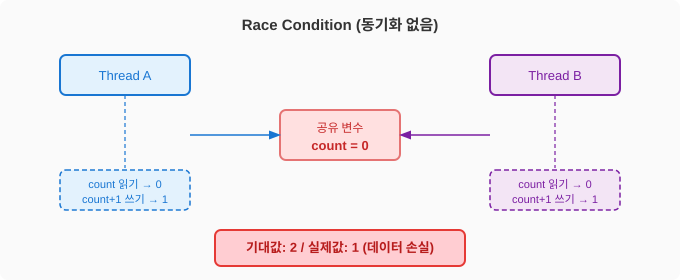
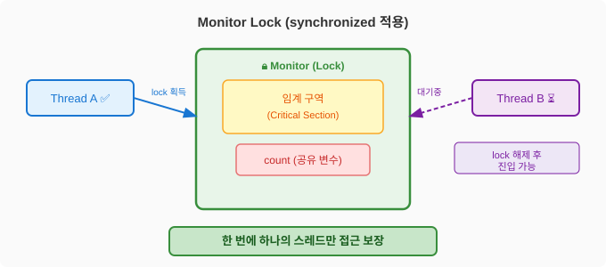
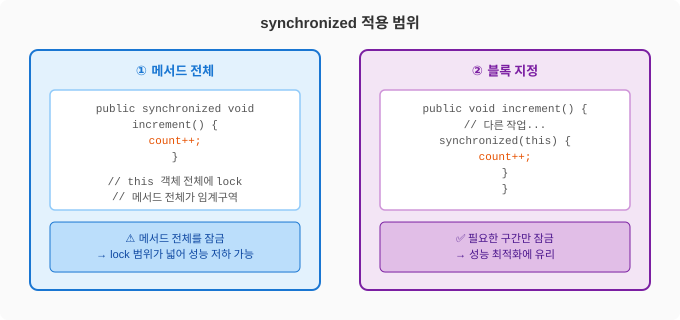

# Java - synchronized

## synchronized란?

멀티스레드 환경에서 **여러 스레드가 공유 자원에 동시에 접근할 때 발생하는 문제(Race Condition)**를 막기 위한 키워드.
하나의 스레드가 임계 구역(Critical Section)에 진입하면 다른 스레드는 lock이 해제될 때까지 대기한다.

---

## Race Condition (동기화 없을 때)



```java
public class Counter {
    private int count = 0;

    public void increment() {
        count++; // 원자적 연산이 아님 (읽기 → 더하기 → 쓰기 3단계)
    }
}

// Thread A, B가 동시에 increment() 호출 시
// 둘 다 count=0을 읽고 → 각각 1을 더해 → count=1 저장
// 기대값: 2 / 실제값: 1 → 데이터 손실
```

---

## Monitor Lock



Java의 모든 객체는 내부적으로 **모니터(Monitor)** 를 하나씩 가지고 있다.
`synchronized` 키워드는 이 모니터 락을 획득/해제하는 방식으로 동기화를 구현한다.

- lock 획득: 임계 구역 진입 시
- lock 해제: 임계 구역 종료 시 (예외 발생해도 자동 해제)
- 대기: 다른 스레드가 lock을 보유 중이면 `BLOCKED` 상태로 대기

---

## 적용 범위



### ① 메서드 전체 동기화

```java
public class Counter {
    private int count = 0;

    public synchronized void increment() {
        count++;
    }

    public synchronized int getCount() {
        return count;
    }
}
```

- `this` 객체 전체에 lock
- 메서드 전체가 임계 구역이 되므로 lock 범위가 넓어 **성능 저하** 가능

### ② 블록 동기화 (권장)

```java
public class Counter {
    private int count = 0;
    private final Object lock = new Object();

    public void increment() {
        // 동기화가 필요 없는 작업은 밖에서 처리
        doSomethingElse();

        synchronized (lock) { // 필요한 구간만 lock
            count++;
        }
    }
}
```

- 특정 구간만 잠금 → **lock 범위를 최소화**하여 성능 최적화
- 별도 lock 객체를 사용하면 여러 임계 구역을 독립적으로 제어 가능

### ③ static 메서드 동기화

```java
public class Counter {
    private static int count = 0;

    public static synchronized void increment() {
        count++;
    }
}
```

- `this`가 아닌 **클래스(Class) 객체**에 lock
- 모든 인스턴스에 걸쳐 하나의 lock을 공유

---

## 실무 예시 — 재고 차감

```java
@Service
public class StockService {

    private int stock = 100;

    // synchronized 없으면 동시 요청 시 재고가 음수가 될 수 있음
    public synchronized boolean decreaseStock(int quantity) {
        if (stock < quantity) {
            return false; // 재고 부족
        }
        stock -= quantity;
        return true;
    }
}
```

단, Spring Bean은 싱글톤이지만 멀티스레드 환경이므로 공유 변수를 사용할 때는 반드시 동기화를 고려해야 한다.

---

## synchronized vs AtomicInteger vs ReentrantLock

| 구분 | 특징 | 사용 시기 |
|------|------|----------|
| `synchronized` | JVM이 자동으로 lock/unlock 관리 | 간단한 동기화, 코드 가독성 중요할 때 |
| `AtomicInteger` | CAS(Compare-And-Swap) 연산으로 lock 없이 원자성 보장 | 단순 숫자 연산 (카운터 등) |
| `ReentrantLock` | 명시적 lock/unlock, tryLock/타임아웃 지원 | 복잡한 lock 제어, 공정성 보장 필요할 때 |

```java
// AtomicInteger 사용 (synchronized보다 성능 좋음)
private AtomicInteger count = new AtomicInteger(0);
count.incrementAndGet(); // 원자적 연산 보장

// ReentrantLock 사용
private final ReentrantLock lock = new ReentrantLock();

public void increment() {
    lock.lock();
    try {
        count++;
    } finally {
        lock.unlock(); // 반드시 finally에서 해제
    }
}
```

---

## 핵심 정리
- `synchronized`는 **한 번에 하나의 스레드만** 임계 구역에 진입하도록 보장
- lock 범위가 넓을수록 성능이 떨어지므로 **블록 동기화**로 최소화
- 단순 카운터는 `AtomicInteger`, 복잡한 제어는 `ReentrantLock`이 더 적합한 경우가 많음
- Spring 환경에서 Bean의 인스턴스 변수는 멀티스레드 접근에 주의
