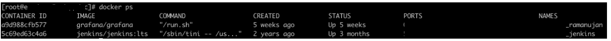
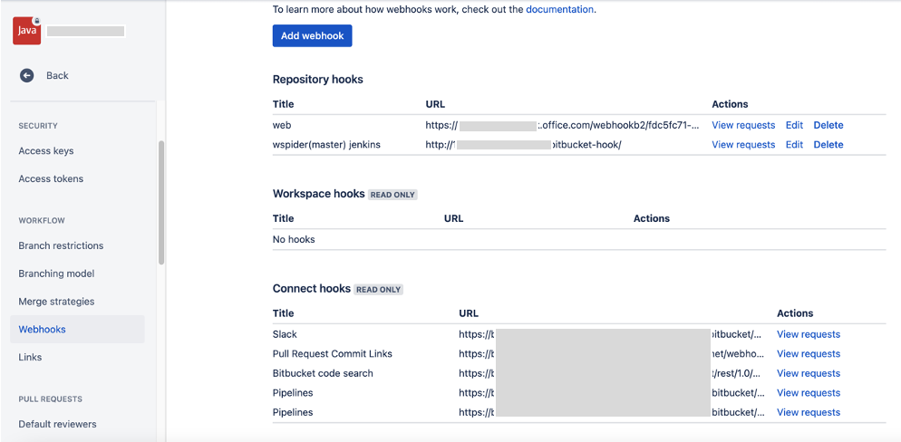
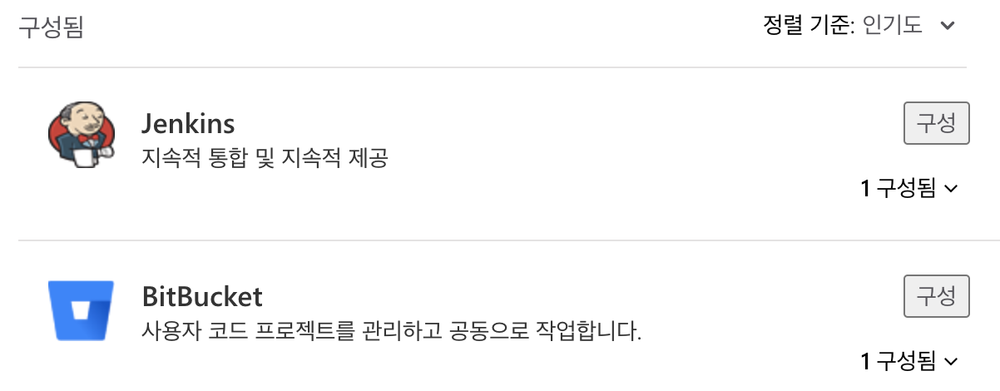
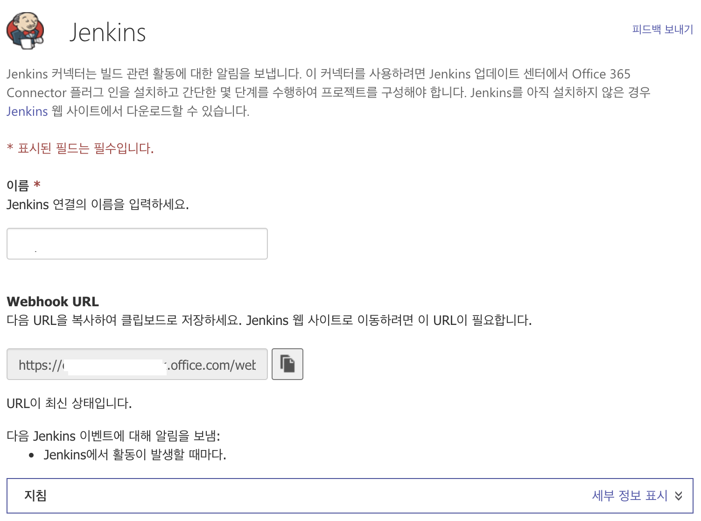
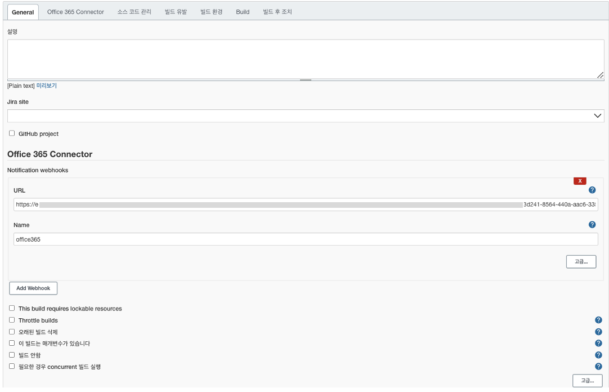
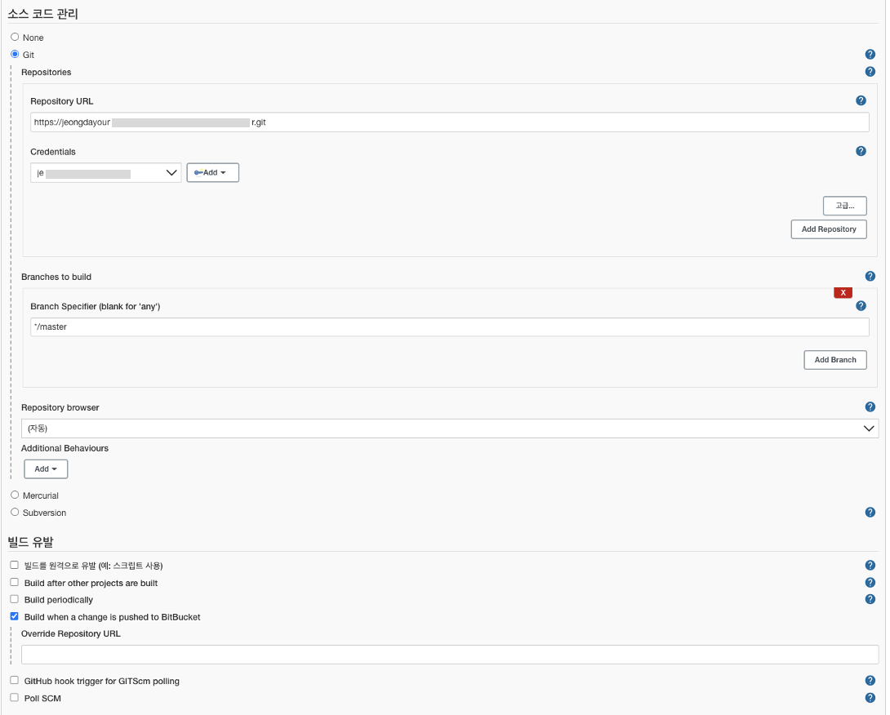
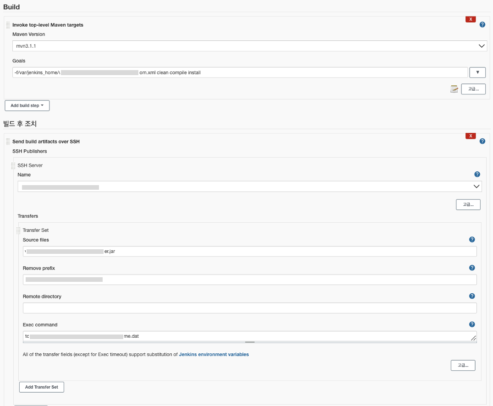
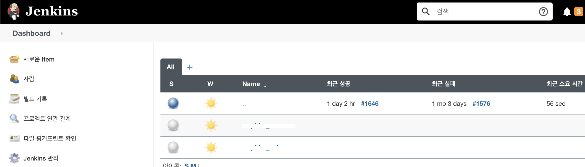
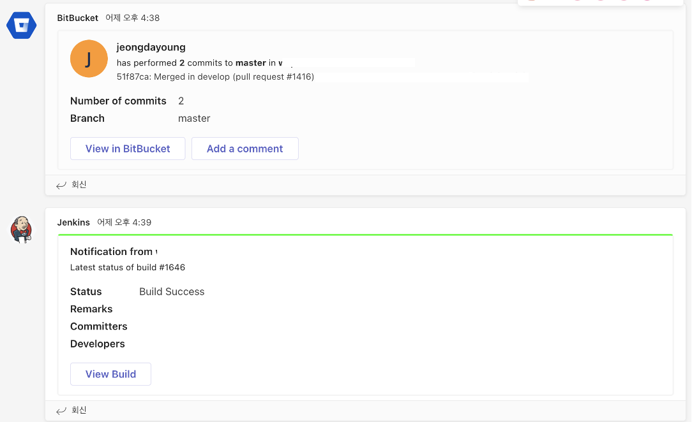

# JenKins란?
 언젠가 정리해야지 하고 미뤄뒀는데, 이번에 새로세팅하면서 정리

젠킨스는 소프트웨어 개발 시 지속적으로 통합 서비스를 제공하는 툴이다. CI(Continuous Integration) 툴 이라고 표현하며, 
자동으로 빌드/배포를 할수있다.

# Jenkins Setting
Bitbucket 과 연동하여, 
Bitbucket webhook을 jenkins에서 변화를 감지하고 알아서 소스코드를 빌드하여 서버에 jar파일을 생성하도록 한다.

1. local 서버 혹은 클라우드서버에 접속하여 젠킨스 설치
2. Bitbucket에서 webhook 설정
3. jenkins에서 webhook정보 및 빌드 설정
 
 

## 1. 젠킨스 설치 (docker)
방법은 간단하다. 
* 젠킨스 이미지 다운로드 
* 젠킨스 컨테이너 설치 및 실행  
 

해당 서버에서 지정한 젠킨스에 접속해서 잘되는지 확인!

<a href="https://narup.tistory.com/202"> 젠킨스 설치 참고</a>
 
 

## 2. Webhook 설정 (Bitbucket / MS Teams)
**Bitbucket** WebHook설정

webhook을 설정하는 화면에서  
* title 입력(본인이 원하는 이름)
* url 입력 (http://{jenkins가 설치되어있는 서버 ip}:8080/bitbucket-webhook/)
save 버튼을 클릭

 모두완료된 화면(회사repo라 주소는 가림)

**MS Teams** WebHook설정  
팀즈에서 알람이 표시될수있도록 webhook도 걸어준다  
<a href="https://confluence.curvc.com/pages/releaseview.action?pageId=109641795"> 팀즈 Bitbucket 연동 </a>

 팀즈에서 Connector 구성
 * 

팀즈에서 구성된 Jenkins의 Webhook URL을 3에서 넣어주어야한다 
 * 
 
 

## 3. Jenkins에서 Webhook정보 및 빌드 설정
<a href="https://nerd-mix.tistory.com/30?category=824214">Jenkins 빌드구축  참고</a>

1,2의 설정을 다 완료했다면, 젠킨스 서버에 접속하여 세팅해야한다
위 참고 URL에서 bitbucket 플러그인설치 및 새로운 item (freestyle project)를 세팅을 한다   

* 
  Office 365 Connector부분 url을 2번에서 설정한 팀즈 젠킨스 url을 넣어주면된다. 
 
* 
소스코드 관리 부분에서 내가 웹훅을걸 repository의 주소와, credentials쪽에 add(user/password)내 빗버킷의 유저이름과 비밀번호를 작성하면된다. 로그인이 안돼서 오류가 뜬적이있는데, 그럴경우
 <code> git ls-remote -h --repo주소 HEAD </code>로 확인해보자
* 
빌드할 메이븐 버전과 빌드후에 생성되는 jar파일의 위치 설정
 
 
 

모두완료되었다면 정상적으로 나오는것을 볼수있다.

 대시보드화면, 파란불이 실행되고있는거

 
  commit -> pull request로 마스터로병합 -> 변경감지 후 젠킨스 빌드 (팀즈에서 알림이온다) 