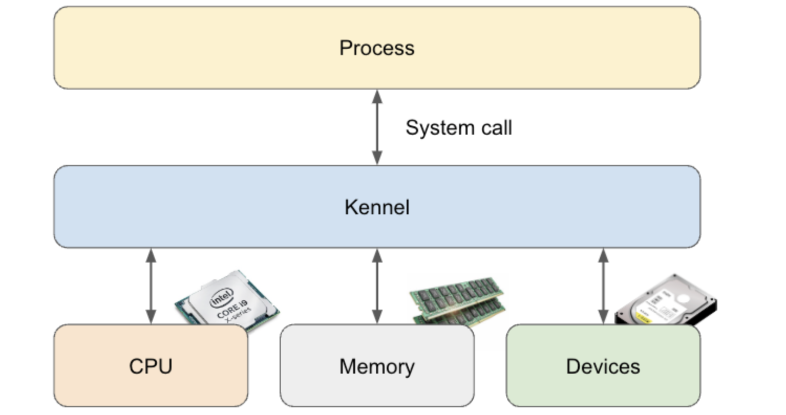

# Linux Kernel

## Linux Kernel 이란?
Linux 커널(kernel)이란 OS의 코어가 되는 부분을 말한다. 메모리 관리, 파일 시스템, 프로세스 관리, 디바이스 제어 등 OS로서 하드웨어나 애플리케이션 소프트웨어를 제어하기 위한 기본적 기능을 갖고 있는 소프트웨어

## 커널의 기능
 * 하드웨어 리소스(CPU, 메모리, 스토리지 등)관리
 * *소프트웨어* 에서 하드웨어 및 리소스에 대한 액세스를 추상화
 

소프트웨어: 프로세스, 커널  
하드웨어: CPU, Memory, Devices(스토리지 등)

## 소프트웨어란?
소프트웨어는 컴퓨터의 처리와 데이터의 집합이고, 하드웨어의 물리적 것에 대해 논리적인 의미를 갖게 한 것이라고 할 수 있다.

주요 소프트웨어 목록
<table>
<thead>
<tr>
	<th>
		소프트웨어
	</th>
	<th>
		이름
	</th>
	<th>
		설명
	</th>
</tr>
</thead>
<tbody>
<tr>
	<td>
		프로그램
	</td>
	<td>
		처리를 위해 만들어진 소프트웨어
	</td>
	<td>
	</td>
</tr>
<tr>
	<td>
		프로세스
	</td>
	<td>
		메모리에 로드된 실행중 프로그램 
		실행중인 프로그램의 단위 
		하위 프로세스는 새롭게 가상 메모리를 확보
	</td>
	<td>
	</td>
</tr>
<tr>
	<td>
		스레드
	</td>
	<td>
		프로세스의 CPU 코어를 사용하는 단위 
		자식 스레드는 상위 스레드 의 가상 메모리를 공유
	</td>
	<td>
	</td>
</tr>
<tr>
	<td>
		응용 프로그램
	</td>
	<td>
		컴퓨터에 사용하는 목적에 따라 제작된 기능적 프로그램
	</td>
	<td>
	</td>
</tr>
<tr>
	<td>
		모듈
	</td>
	<td>
		특정 기능을 가진 작은 프로그램 
		모듈을 결합하여 응용 프로그램과 라이브러리를 만듭니다.
	</td>
	<td>
	</td>
</tr>
<tr>
	<td>
		라이브러리
	</td>
	<td>
		재사용 가능한 형태로 정리한 프로그램 
		라이브러리 단독으로는 동작하지 않는다
	</td>
	<td>
	</td>
</tr>
<tr>
	<td>
		패키지
	</td>
	<td>
		프로그램의 실행에 필요한 것을 정리한 것 
		구체적으로는 이하와 같은 것이 포함됩니다. 
		- 실행 파일 
		- 라이브러리- 모듈 
		- 설정 파일 
		- 자원 (이미지, 음악 파일 등) 
		 
		패키지와 라이브러리 사이의 관계에 대해서는 달걀이 먼저 또는 닭이 끝나는 것과 같은 이야기로 
		패키지A에 포함되는 라이브러리에는 패키지B가 포함되어 있거나 한다.
	</td>
	<td>
	</td>
</tr>
<tr>
	<td>
		미들웨어
	</td>
	<td>
		어플리케이션이 자주 이용하는 OS의 기능을 정리한 프로그램
	</td>
	<td>
	</td>
</tr>
<tr>
	<td>
		커널
	</td>
	<td>
		하드웨어를 조작하기 위한 소프트웨어
	</td>
	<td>
	</td>
</tr>
<tr>
	<td>
		시스템 라이브러리
	</td>
	<td>
		응용 프로그램이 커널을 호출하는 라이브러리
	</td>
	<td>
	</td>
</tr>
<tr>
	<td>
		시스템 유틸리티
	</td>
	<td>
		컴퓨터의 &ldquo;분석, 관리, 유지 보수&quot;를 수행하는 소프트웨어
	</td>
	<td>
	</td>
</tr>
<tr>
	<td>
		OS
	</td>
	<td>
		커널, 시스템 라이브러리, 시스템 유틸리티를 정리한 것
	</td>
	<td>
	</td>
</tr>
</tbody>
</table>
 

## 하드웨어 리소스 추상화
커널의 기능의 하나인 &ldquo;하드웨어 자원의 추상화&quot;란, 하드웨어의 차이를 OS가 흡수하는 것이다.
프로그램은 하드웨어의 다르다는 것에 걱정할 필요가 없다.  
프로그램은 아래 3개가 다르다는 것을 인식할 필요 없이 시스템 호출 <code>write()</code>로 쓰기가 가능하다.
* A사의 SSD
* B사의 SSD
* C사의 USB 메모리

 

## 커널의 기능

<table>
<thead>
<tr>
	<th>
		커널 기능
	</th>
	<th>
		대상 하드웨어
	</th>
	<th>
		설명
	</th>
</tr>
</thead>
<tbody>
<tr>
	<td>
		프로세스 관리
	</td>
	<td>
		CPU
	</td>
	<td>
		프로세스 에 CPU 할당
	</td>
</tr>
<tr>
	<td>
		메모리 관리
	</td>
	<td>
		메인 메모리
	</td>
	<td>
		프로세스 에 메모리 할당
	</td>
</tr>
<tr>
	<td>
		스토리지 관리 
		파일 시스템
	</td>
	<td>
		스토리지
	</td>
	<td>
		프로세스에서 스토리지로 데이터 읽기 및 쓰기
	</td>
</tr>
<tr>
	<td>
		I/O 디바이스
	</td>
	<td>
		관리 모든 기기
	</td>
	<td>
		장치에 입출력
	</td>
</tr>
</tbody>
</table>