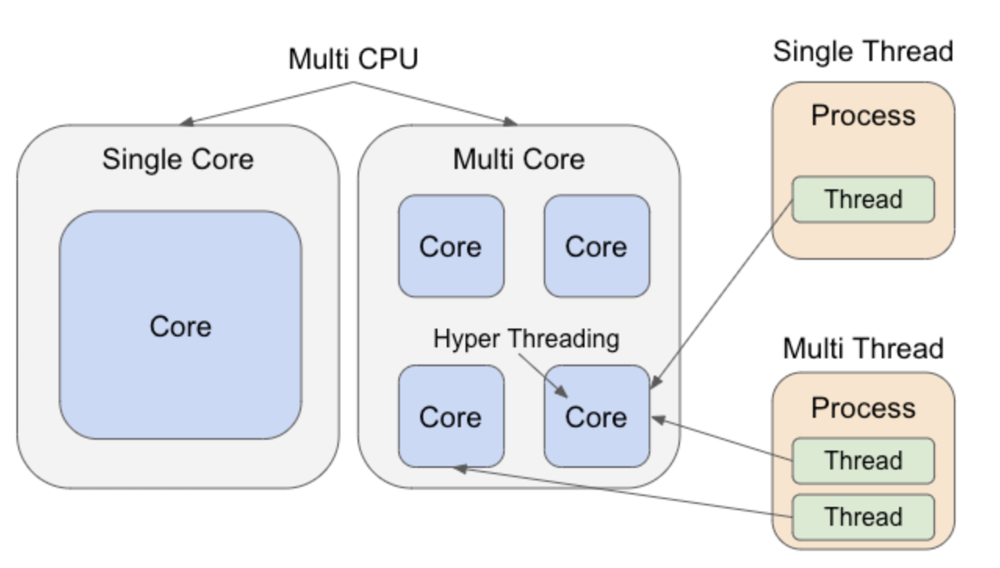

# Linux Kernel-CPU 및 프로세스

### 프로세스란?
프로세스는 CPU에서 실행하기 위해 메모리에 로드한 프로그램이다.

**프로세스 확인 명령**
~~~
$ ps aux

USER         PID %CPU %MEM    VSZ   RSS TTY      STAT START   TIME COMMAND
root           1  0.1  2.1 240344 10168 ?        Ss   19:13   0:01 /usr/lib/syst
root           2  0.0  0.0      0     0 ?        S    19:13   0:00 [kthreadd]
~~~

<table>
<thead>
<tr>
<th>헤더</th>
<th>설명</th>
</tr>
</thead>
<tbody>
<tr>
<td>USER</td>
<td>사용자 이름</td>
</tr>
<tr>
<td>PID</td>
<td>프로세스 ID</td>
</tr>
<tr>
<td>%CPU</td>
<td>프로세스 사용률</td>
</tr>
<tr>
<td>%MEM</td>
<td>실제 메모리에 대한 프로세스 비율</td>
</tr>
<tr>
<td>VSZ</td>
<td>가상 메모리에 할당한 프로세스의 크기</td>
</tr>
<tr>
<td>RSS</td>
<td>실제 메모리에 할당된 프로세스의 크기</td>
</tr>
<tr>
<td>TTY</td>
<td>제어 터미널</td>
</tr>
<tr>
<td>STAT</td>
<td>프로세스 상태 - D 인터럽트 불가능한 슬립 상태 (일반 IO) - R 실행 중 또는 실행 가능 상태 (실행 대기열에 있음) - S 인터럽트 가능한 슬립 상태 (이벤트 완료를 기다리고 있음) - T 작업 제어 신호 또는 추적 중이므로 정지 상태 - W 페이징 상태 (2.6.xx 커널 에서 유효하지 않음) - X 꺼진 상태 (보이지 않아야 함) - Z 사라진(좀비) 프로세스</td>
</tr>
<tr>
<td>START</td>
<td>프로세스 시작일</td>
</tr>
<tr>
<td>TIME</td>
<td>누적된 CPU 시간</td>
</tr>
<tr>
<td>COMMAND</td>
<td>프로세스 실행 명령</td>
</tr>
</tbody>
</table>

___

## 프로세스와 스레드의 차이 
하나의 프로세스에는 하나 이상의 스레드가 있다.

|      |  프로세스        | 스레드   |
| ---- | -------------  | -------|
|  단위 | 프로그램 실행 단위 | CPU 사용 단위|
| 메모리 | 자식 프로세스를 위한 새로운 영역 확보 | 상위 스레드와 하위 스레드간에 공유(스택 세그먼트 제외)|
| 생성  | 느림(메모리 에 새로운 영역을 확보하기 위해)) | 빠름|

 예를 들어, 그림 그리기 프로그램 이 있다고 가정하면,  
프로세스 : 그림 그리기 프로그램을 실행
, 스레드: 실행한 그림 프로그램의 각 CPU의 처리(“마우스 조작의 대응”, “그림의 묘사” 등)

## 프로세스(스레드) 병렬 처리
프로세스를 CPU 로 처리하는 경우, 병렬로 처리하는 방법은 아래 4개가 존재
 
* 멀티 CPU : 여러 CPU를 사용한다.
* 멀티 코어 : 하나의 CPU에 있는 여러 코어를 사용한다.
* 하이퍼 스레딩 : 하나의 코어에 여러 스레드를 할당한다.
* 다중 스레드 : 하나의 프로세스가 여러 스레드를 갖는다
---

## CPU확인 명령어
사용하고 있는 CPU는 **lscpu(혹은 cat /proc/cpuinfo)** 명령어로 확인 
~~~
$ lscpu
Architecture:        x86_64
CPU op-mode(s):      32-bit, 64-bit
Byte Order:          Little Endian
CPU(s):              4
On-line CPU(s) list: 0-3
Thread(s) per core:  2
Core(s) per socket:  2
Socket(s):           1
NUMA node(s):        1
Vendor ID:           AuthenticAMD
CPU family:          23
Model:               24
Model name:          AMD Ryzen 5 3400G with Radeon Vega Graphics
Stepping:            1
CPU MHz:             3692.932
BogoMIPS:            7385.86
Hypervisor vendor:   Microsoft
Virtualization type: full
L1d cache:           32K
L1i cache:           64K
L2 cache:            512K
L3 cache:            4096K
NUMA node0 CPU(s):   0-3
Flags:               fpu vme de pse tsc msr pae mce cx8 apic sep ....
~~~

> ***프로세스 우선 순위 확인***  
<code>$ ps alx</code>  

>> Todo:   
프로세스 관리 관련해서는 cs공부를 따로 더 해보도록하자  
(프로세스 상태 전이, PCB (Process Control Block), CPU 스케줄러 (단기 스케줄러)... 등등)