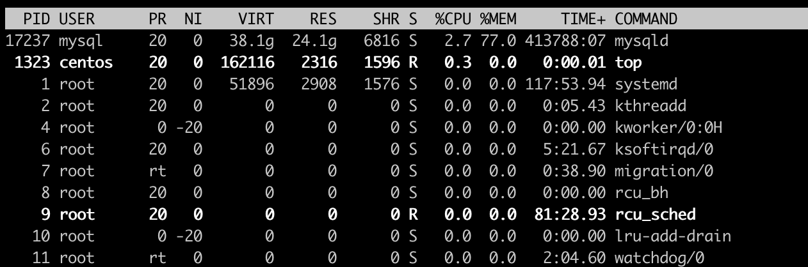

# Linux Server Monitoring

## 네트워크 관리
~~~
네트워크 인터페이스 정보 확인
$ ifconfig

docker0: flags=4163<UP,BROADCAST,RUNNING,MULTICAST>  mtu 1500
        inet 172.17.0.1  netmask 255.255.0.0  broadcast 0.0.0.0
        inet6 fe80::42:29ff:fea5:8c7f  prefixlen 64  scopeid 0x20<link>
        ether 02:42:29:a5:8c:7f  txqueuelen 0  (Ethernet)
        RX packets 1465677  bytes 23178072491 (21.5 GiB)
        RX errors 0  dropped 0  overruns 0  frame 0
        TX packets 2047732  bytes 477309312 (455.1 MiB)
        TX errors 0  dropped 0 overruns 0  carrier 0  collisions 0

네트워크의 상태 및 성능을 측정
$ netstat

Active Internet connections (w/o servers)
Proto Recv-Q Send-Q Local Address           Foreign Address         State
tcp        0      0 localhost:31000         localhost:32000         ESTABLISHED
~~~

* Proto : 해당 통신이 사용하는 프로토콜을 나타낸다.
* Recv-Q , Send-Q : 해당 통신이 사용할 때 소켓 사이즈 버퍼를 의미하며 Recv-Q의 경우 recv()를 - 통해 처리 받지 못한 데이터를 의미하며 Send-Q의 경우 send()를 통해 보냈지만 아직 완전하게 외부로 보내지지 않은 데이터의 크기를 의미한다.
* Local Address, Foreign Address : 말 그대로 해당 통신에서 나가는 내 주소와 목적지에 해당하는 주소를 의미한다.
* (state) : ESTABLISHED, LISTEN과 같은 상태를 나타낸다.

netstat 옵션은 주로 -lntup를 쓴다.
그 외에 -antup, -ltup, -atup 등을 쓴다. </spu>

## 프로세스 관리
***ps 명령어*** : 현재 작동하는 프로세스의 목록을 출력한다.
option:
* -e : 모든 프로세스 정보 출력
* -f : 프로세스의 다양한 정보 출력
* -a : 실행중인 전체 사용자의 모든 프로세스 출력
* -u : 프로세스를 실행한 사용자 정보와 프로세스 시작 시간등 출력
* -x : 제어 터미널을 갖지 않는 프로세스 출력
~~~
PID와 PPID를 확인할 수 있다.

$ ps -ef | grep java

root      6938  6897  0  8월09 ?      03:19:51 java -Duser.home=/var/jenkins_home -Djenkins.model.Jenkins.slaveAgentPort=50000 -jar /usr/share/jenkins/jenkins.war

root     32537 32534  0  8월12 ?      06:08:34 java -XX:MaxPermSize=192m -Djava.io.tmpdir=./tmp -Djava.net.preferIPv4Stack=true
~~~

***top 명령어*** : 실시간 프로세스 모니터링 프로그램  
기본적으로 3초마다 화면이 갱신되고 스페이스바를 누르면 바로 갱신된다.

 
 

option: 
* -d [시간] : 화면 갱신 시간 설정
* -i : idle 상태와 좀비 프로세스 무시

top 실행중 사용 가능 명령어
* k : kill 명령
* r : nice값 변경
* l : top 맨 윗줄 항목 on/off
* m : 메모리 항목 on/off
* t : 프로세스와 CPU 항목 on/off
* c : command line의 옵션 on/off
* q : 프로그램 종료

## 프로세스 종료
***kill 명령어*** : 프로세스 종료시킨다.
option(signal):
* -1 : 재실행(HUP)
* -9 : 강제종료(KILL)
* -15 : 기다렸다 정상 종료(TERM)
~~~
// 프로세스명이 tomcat인 항목의 PID 확인
$ ps -ef | grep tomcat
  501  2177     1   0 11:36PM ttys000    0:05.94 

... 생략 ...

// PID가 2177인 프로세스 종료
$ kill -9 2177
~~~