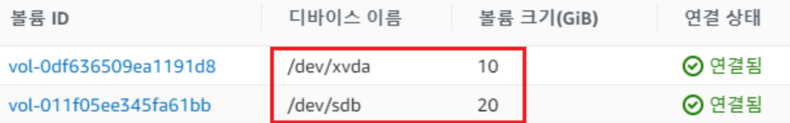
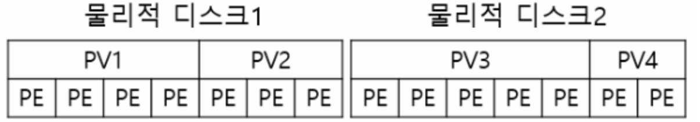
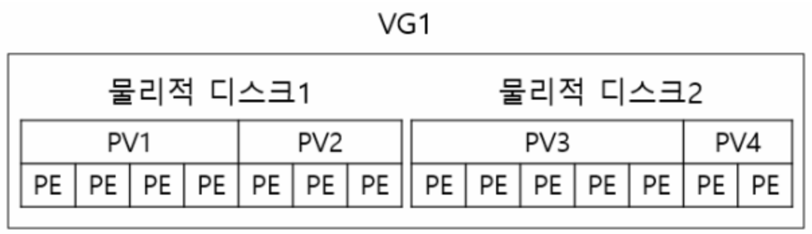
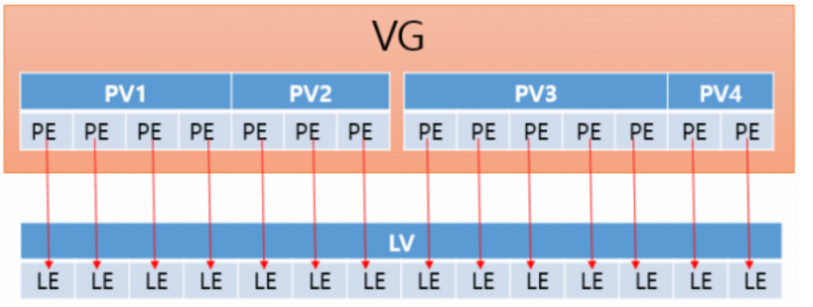

# LVM

Logical Volume을 효율적이고 유연하게 관리하기 위한 커널의 한 부분이자 프로그램

## 사전작업
 * EC2 생성 시 LVM 볼륨으로 사용할 볼륨도 함께 생성
 * 

## 개념정리 
1. ***PV(Physical Volume)***:  블록 장치 전체 또는 블록 장치를 이루는 파티션들을 LVM에서 사용할 수 있게 변환하는 것이며, PV는 일정한 크기의 PE(Physical Extent)들로 구성
 (ex. /dev/sda1, /dev/sda2 등의 블록 스토리지를 LVM으로 쓰기위해 PV로 초기화)  
 * 

2. ***VG(Volume Group)*** :  PV들의 집합으로 LV를 할당할 수 있는 공간
  * 
3. ***LV(Logical Volume)***:  사용자가 최종적으로 다루게 되는 논리적인 스토리지이며,  LV를 구성하는 LE들은 PV의 PE들과 맵핑하며 존재
  * 
4. ***Mount*** :  실제로 디바이스를 사용할 수 있도록 파일시스템과 디렉토리를 할당하는 것

### 기존 파티션 확인
~~~sh
$ df -h
~~~
### 새로 추가된 디스크 확인
~~~sh
$ fdisk -l
~~~

### 추가된 디스크로 새 파티션 생성
~~~sh
$ fdisk /dev/[디스크명]

예) fdisk /dev/vdc
~~~
~~~sh
Command (m for help): n
Command action: p
Partition number (1-4): 1
First cylinder (1-65270, default 1): enter
Last cylinder, +cylinders or +size{K,M,G} (1-65270, default 65270): enter
Command (m for help): t
Hex code (type L to list codes): 8e
Command (m for help): w
~~~

### 현재 잡혀있는 PV(Physical Volume) 확인
~~~sh
$ pvscan
~~~~

### 새로 만든 파티션을 PV로 생성
~~~sh
$ pvcreate /dev/[파티션명]
예) pvcreate /dev/vdc1
~~~

### 다시 잡혀있는 PV 확인
~~~sh
$ pvscan
~~~

### VG 확인
~~~sh
$ vgdisplay
~~~

### PV를 기존 VG(Volume Group)에 추가
~~~sh
$ vgextend [볼륨그룹명] /dev/[파티션명]
예) vgextend vg /dev/vdc1
~~~

### VG에  Free추가 확인
~~~sh
$ vgdisplay
~~~

### 논리볼륨명 확인
~~~sh
$ lvdisplay
~~~

### LV 생성
~~~sh
lvcreate --extents 100%FREE -n 논리볼륨명 볼륨그룹명
예) lvcreate --extents 100%FREE -n lv vg
~~~

### 추가하고싶은 LV(Logical Volume)확장 (용량에 따라 3분~ 이상 걸림)
~~~sh
lvextend /dev/[볼륨그룹명]/[논리볼륨명] -l +100%FREE
예) lvextend /dev/vg/lv -l +100%FREE
~~~

### 다시 잡혀있는 VG 확인
~~~sh
vgdisplay
~~~

### Mount
~~~sh
$ mkdir /dev (*mount위치)

$ mount -t ext4 /dev/[볼륨그룹명]/[논리볼륨명] /[mount위치]
예) mount -t ext4 /dev/vg/lv /dev

$ df -h

$ vi /etc/fstab
UUID=2a26ef54-f409-48af-b6b1-0452fc0028b5 /(변경하지않음) ext4 defaults,noatime,nodev 1 1
(가장 아래에 입력)

$ /dev/[볼륨그룹명]/[논리볼륨명] /[mount위치] ext4 defaults 0 0
예) /dev/vg/lv /dev ext4 defaults 0 0
~~~

