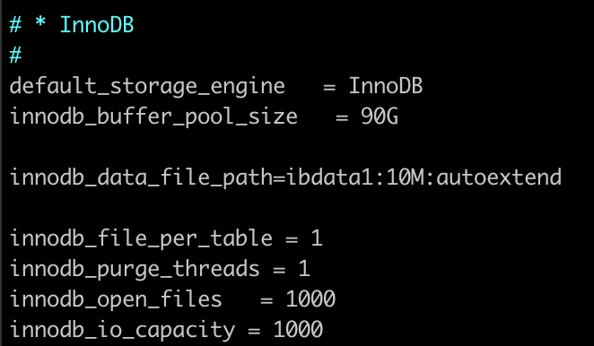

# DB Custom Setting

### MySQL Data directory 변경하기
* lvm 구성시 mount dir를 data로 설정

~~~
mkdir /data/mysql
sudo cp -R /var/lib/mysql/* /data/mysql
sudo chown -R mysql:mysql /data/mysql
~~~

~~~
mkdir /data/mysql
sudo cp -R /var/lib/mysql/* /data/mysql
sudo chown -R mysql:mysql /data/mysql

vi /etc/my.cnf
기존 DB서버의 /etc/my.cnf내용 복사한 후
datadir=/data/mysql 로 변경한다

==========================

[centos 7 일 경우]
디텍터리에 대한 보안 설정으로 인해 yum 추가 설치

$sudo yum install -y policycoreutils-python

SELinux 보안 context 추가
$sudo semanage fcontext -a -t mysqld_db_t "/data/mysql(/.*)?"
$sudo restorecon -R /data/mysql
~~~
* InnoDB buffer pool size 커스텀

### MariaDB MaxConnection 증가
~~~
show status like 'max_threads%';

set global max_connections=950;
set global thread_pool_max_threads=950;
show global variables where variable_name='thread_pool_max_threads'

show variables like 'max_connections';
show variables like 'open_files_limit';
~~~

### MariaDB openfile limit 설정
mysql이 오픈할수 있는 file(정확히는 file descripter)개수

## [centos 7- MariaDB 데이터 디렉토리 변경]

1. 설정 변경 전 서비스를 중단한다.
    systemctl stop mariadb.service

2. 변경하고자 하는 위치에 디렉토리를 생성한 후 Owner와 Group을 mysql로 지정한다.

3. 기본디렉토리인 /var/lib/mysql에 있는 파일을 모두 /app/data/mysql로 복사한다.
    참고 : mysql.sock 파일은 mysql 데몬이 처음 실행되는 시점에 자동으로 생성된다.

4. /etc/my.inf에 변경하고자 하는 데이터 디렉토리와 소켓경로,
   /etc/my.inf.d/server.inf의 하단에 변경하고자 하는 데이터 디렉토리를 명시한다.

   예시)
   ~~~
   [mysqld]
   datadir = /app/data/mysql/
   socket = /app/data/mysql/mysql.sock

   [client]
   datadir = /app/data/mysql/
   port = 3306
   ~~~

5. CentOS7부터는 SELinux(임의 접근 제어 모듈)을 포함하고 있다. ->   기본 경로 외의 위치에 접근하는 경우 permission 에러 발생  

    따라서 위 설정 후 systemctl start mariadb.service 로 서비스를 시작하려고 하는 경우,
    Job for mariadb.service failed because the control process exited with error code. See "systemctl status mariadb.service" and "journalctl -xe" for details. 같은 에러가 발생한다.
   새로운 경로를 추가하기 위해서 semanage 명렁어를 입력한다.

    예시)
    semanage fcontext -a -t mysqld_db_t "/app/data/mysql(/.*)?"
    restorecon -R /app/data/mysql

6. 설정 후 서비스를 시작한다
    systemctl stop mariadb.service

7. db로 정상적으로 접속되는지 확인한다.