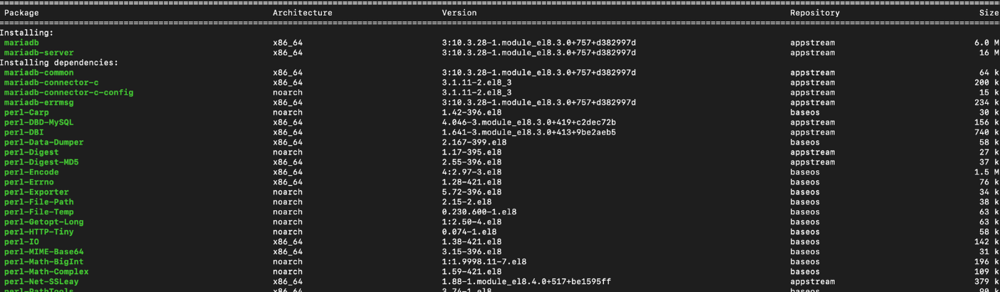
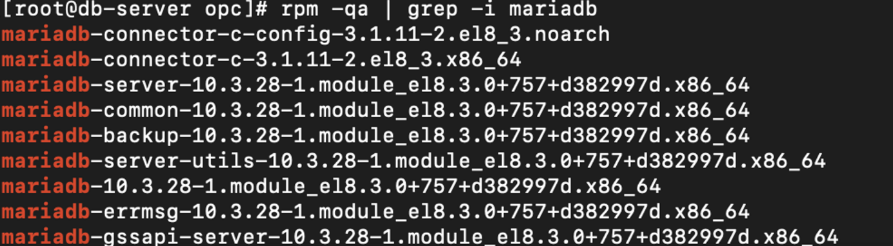
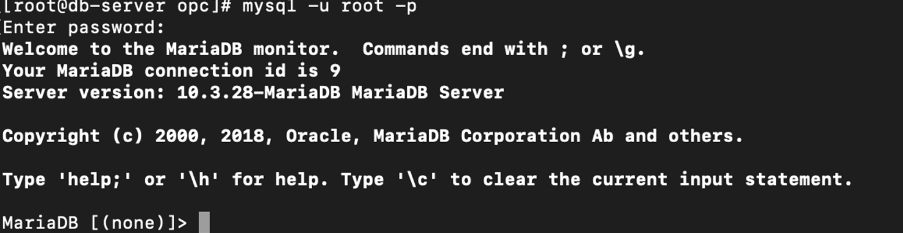

# MariaDB -install Centos7

##  1.MariaDB 저장소 추가
~~~
vi /etc/yum.repos.d/MariaDB.repo
~~~
위의 명령어를 입력하여 yum 저장소 정보를 생성한다.

생성한 repo안에 아래 내용 기입
~~~
[mariadb]
name = MariaDB
baseurl = http://yum.mariadb.org/10.0/centos7-amd64
gpgkey=https://yum.mariadb.org/RPM-GPG-KEY-MariaDB
gpgcheck=1

입력후 저장
$ wq!
~~~
* link:  http://downloads.mariadb.org/mariadb/repositories/

##  2. MariaDB 설치
~~~
sudo yum install -y MariaDB-Galera-server MariaDB-client galera

==위 설치 혹은 아래 명령어 
sudo yum install mariadb mariadb-server
~~~
* 설치된 화면,  Is this ok [y/N]: y 

설치완료후 아래 명령어로 MariaDB가 정상적으로 설치되었는지를 확인
~~~
 $ rpm -qa | grep -i mariadb
~~~
* 

## 3. MariaDB 실행
~~~
$ systemctl start mariadb

$ systemctl status mariadb 활성상태확인

service mysql start
~~~

## 4.MariaDB 접속확인
~~~
$ mysql -uroot -p

(enter) 후 진입
MariaDB > show variables where variable_name like 'datadir';
MariaDB > show variables like 'char%';
~~~
* 제대로 작동된 화면
 

### 5. MariaDB 서버 방화벽 추가 및 외부접속 허용
[방화벽]
~~~
sudo chkconfig iptables off
sudo chkconfig --list | grep iptables
sudo service iptables stop

===
현재 리눅스에서 열려있는 포트 확인
$ netstat -tnlp
#TCP 중에서(t), Listening상태[열린포트]인 애들만(l), 상세정보까지(p), 10진수 숫자로(n) 표기

방화벽에 포트추가(instance에 ip를 추가해놨기때문에 굳이하지않아도된다)
$ firewall-cmd --permanent --zone=public --add-port=22/tcp

추가한 설정 조회
$ firewall-cmd --list-all

방화벽 해제하기
$ systemctl stop firewalld

# systemctl start firewalld    시작
# systemctl enable firewalld    재부팅시 자동 설정
# systemctl stop firewalld    중지
# systemctl disable firewalld    재부팅시 자동 설정하지 않음
~~~
[계정생성 및 권한설정]
~~~
$ use mysql (스키마를 mysql로 변경)

계정추가
$ create user '계정아이디'@localhost identified by '비밀번호'; 
ex) create user prj@localhost identified by 'prj!@#'

#위의 경우는 localhost만 가능하기때문에, 외부접속 허용은 %로 변경하면된다
$ create user '계정아이디'@'%' identified by '비밀번호';

계정삭제
$ delete from user where user = 'prj';

해당 계정에 권한설정
$ GRANT ALL PRIVILEGES ON *.* TO 'prj'@'%';
$ FLUSH PRIVILEGES;
~~~

