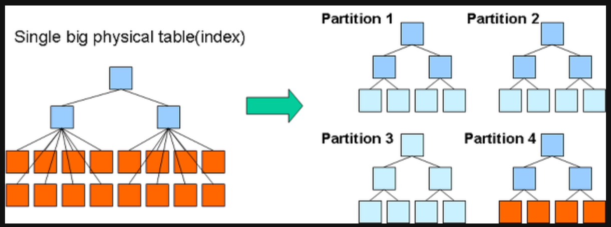
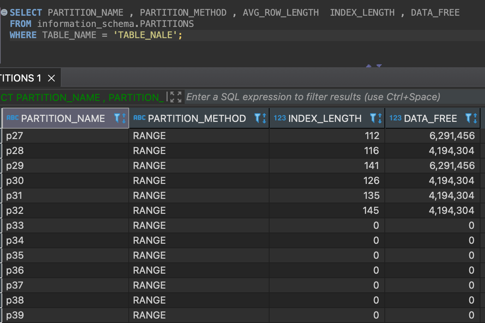

# MySql - Partition

## Partition
파티션이란 MySQL 서버 입장에서는 데이터를 별도의 테이블로 분리해서 저장하지만 사용자 입장에서는 하나의 테이블로 읽기와 쓰기를 할 수 있게 해주는 기능을 의미한다  

파티셔닝하지 않고 하나의 큰 테이블로 사용하면 인덱스도 커지고 그만큼 물리적인 메모리 공간도 많이 필요해진다.

결과적으로 파티션은 데이터와 인덱스를 조각화해서 물리적 메모리를 효율적으로 사용할 수 있게 만들어 준다

**장점**
* INSERT와 범위 SELECT의 빠른 처리
  * 테이블의 사이즈의 커서 인덱스의 크기가 메모리 크기 보다 훨씬 큰 경우 파티션 테이블을 이용하여 분할 할 경우 인덱스도 각각 생성되기 때문에 작은 인덱스 크기로 인해 메모리에서 빠르게 쿼리 작업을 진행할 수 있다
* 주기적으로 삭제 등의 작업이 이루어지는 이력성 데이터의 효율적인 관리
  * 비지니스 로직이나 제도화된 법에 의해서 필수 보관주기가 지난 데이터의 정리나 로그성 데이터의 테이블을 파티션 테이블로 관리한다면 불필요한 데이터 삭제 작업은 단순히 파티션을 추가하거나 삭제하는 방식으로 간단하고 빠르게 해결할 수 있다.

  * DML 인 Delete 로 처리하게 된다면 삭제대상을 조회하는 부하/Operation 과 Redo/Undo를 생성하는 DML영역의 Operation 의 부하등이 동반되기 때문에 파티션을 사용한 파티션 단위의 Drop 을 이용하면 이런 부분을 대폭 줄일 수 있다.

**파티션 테이블 사용시 주의사항**  
MySQL에서는 일반적으로 테이블을 파일 단위로 관리하고 InnoDB에서 innodb_file_per_table 를 보통 설정하여 사용 하기 때문에 MySQL에서 동시에 오픈하게 되는 파일의 개수가 상당히 많아질 수 있다.

파티션의 수 만큼 File 을 Open 하기 때문에 관련된 파라미터를 사전에 조정해주거나 파라미터 값에 도달하는지를 확인할 필요가 있다.

MySQL 엔진 측면에서 open_files_limit 과 OS 측면에서는 nofile 이 있으며, Open File Descriptor 와 관련된 파라미터 이다.

 * open_files_limit 의 기본값은 5000, with possible adjustment 
 * my.cnf 파일에 open_files_limit 값을 늘려줘야 하며 /etc/security/limits.conf 파일에서 nofile 를 지정하여 값을 늘려줄수 있다.

~~~sh
my.cnf
[mysqld]
open_files_limit=10000

/etc/security/limits.conf
mysql hard nofile 65536
mysql soft nofile 65536
~~~

## 문법

### 일자단위 파티션생성
~~~sql
CREATE TABLE raw_log_2011_4 (
  id bigint(20) NOT NULL AUTO_INCREMENT,
  logid char(16) NOT NULL,
  tid char(16) NOT NULL,
  reporterip char(46) DEFAULT NULL,
  ftime datetime DEFAULT NULL,
  KEY id (id)
) ENGINE=InnoDB AUTO_INCREMENT=286802795 DEFAULT CHARSET=utf8
  PARTITION BY RANGE( TO_DAYS(ftime) ) (
    PARTITION p20110401 VALUES LESS THAN (TO_DAYS('2011-04-02')),
    PARTITION p20110402 VALUES LESS THAN (TO_DAYS('2011-04-03')),
    PARTITION p20110403 VALUES LESS THAN (TO_DAYS('2011-04-04')),
    PARTITION p20110404 VALUES LESS THAN (TO_DAYS('2011-04-05')),
    PARTITION p20110426 VALUES LESS THAN (TO_DAYS('2011-04-27')),
    PARTITION p20110427 VALUES LESS THAN (TO_DAYS('2011-04-28')),
    PARTITION p20110428 VALUES LESS THAN (TO_DAYS('2011-04-29')),
    PARTITION p20110429 VALUES LESS THAN (TO_DAYS('2011-04-30')),
    PARTITION future VALUES LESS THAN MAXVALUE
  );

create index raw_log_2011_4_idx01 on raw_log_2011_4(ftime)
~~~

### 파티션 추가
~~~sql
ALTER TABLE employees ADD PARTITION(PARTITION p4 VALUES LESS THAN (2009));
~~~
### 파티션 삭제
~~~sql
ALTER TABLE employees DROP PARTITION p4;
~~~
### 기존 파티션의 분리
~~~sql
ALTER TABLE employees 
REORGIANIZE PARTITION p3 INTO (
PARTITION p3 VALUES LESS THAN (2013),
PARTITION p4 VALUES LESS THAN MAXVALUE
);
~~~
### 기존 파티션의 병합
~~~sql
ALTER TABLE employees 
REORGANIZE PARTITION p2,p3 INTO (
PARTITION p23 VALUES LESS THAN (2012)
);
~~~

* 파티션 p27 ~ p 32에 데이터가 존재하는것을 확인할 수 있다. 

