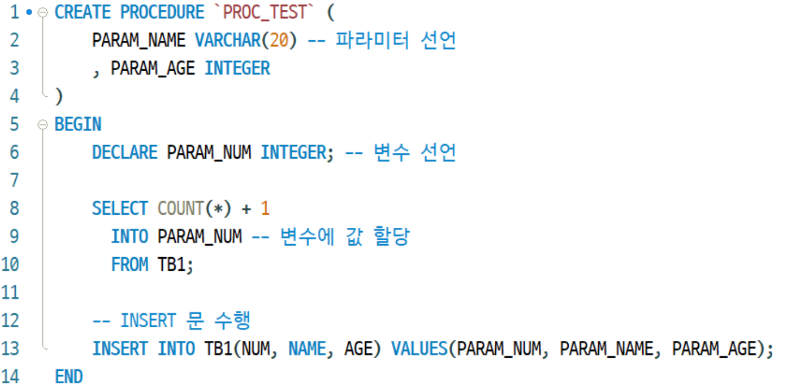

# MariaDB - Procedure
프로시저(Procedure)를 사용해 주면
여러 쿼리를 프로시저 하나로 실행시킬 수 있는데,

함수(Function)와 비교해 보자면
함수는 쿼리를 수행한 후 값을 가져오는 것이 중점이지만
프로시저는 여러 쿼리를 한번에 수행하는 것이 중점이다.

* 프로시져 실행은 프로시저명() 안에 있는 파라미터 선언부분
BEGIN ~ END 사이에 수행할 쿼리 두 부분이 중요하다  

* 위 명령어를 실행하면 프로시져가 등록이된다

## 확인 명령어
[프로시저 목록 확인]  
mysql> show procedure status 

[프로시저 스크림트 확인]  
mysql> show create procedure 프로시저이름

[프로시저 호출]
mysql> call 프로시저이름

[프로시저 삭제]
mysql> drop procedure 프로시저이름;

---
 
일정한 형식에 맞추어 json-string을 만드는 프로시져  
" , " 값으로 길이를 구분하여 알맞을 key가 생성되도록함

아래 프로시져를 생성 후 호출
~~~
call SERVICE_INSERT(:P_COLLECT_SITE, :P_LIST_TAG, :P_URL_TAG, ...)
생성되며, 설정된 parameter에 맞추어서 넣고 실행한다
~~~

~~~
CREATE DEFINER=`jdy`@`%` PROCEDURE `AUTO_SERVICE_INSERT`(
P_COLLECT_SITE VARCHAR(100),
P_LIST_TAG VARCHAR(100),
P_ITEM_NUM_REG VARCHAR(100),
P_URL_TAG VARCHAR(100),
P_GOODS_NAME_TAG VARCHAR(100),
P_THUMBNAIL_TAG VARCHAR(100),
P_PRICE_TAG VARCHAR(100),
P_DIS_PRICE_TAG VARCHAR(100),
P_AVG_POINT_TAG VARCHAR(100),
P_REVIEW_CNT_TAG VARCHAR(100)
)
BEGIN
	DECLARE URL_JSON VARCHAR(100);
	DECLARE GOODS_NAME_JSON VARCHAR(100);
	DECLARE THUMBNAIL_JSON VARCHAR(100);
	DECLARE PRICE_JSON VARCHAR(100);
	DECLARE DIS_PRICE_JSON VARCHAR(100);
	DECLARE AVG_POINT_JSON VARCHAR(100);
	DECLARE REVIEW_CNT_JSON VARCHAR(100);

	SELECT 
		(CASE
			SUM((CHAR_LENGTH(P_URL_TAG)-CHAR_LENGTH(REPLACE(P_URL_TAG,',',''))) +1) 
		WHEN 1 THEN CONCAT('{"tag":"' , (SUBSTRING_INDEX(P_URL_TAG, ',', 1)) , '"}' )
		WHEN 2 THEN CONCAT('{"tag":"' , (SUBSTRING_INDEX(P_URL_TAG, ',', 1)) , 
						   '","attr":"' , (SUBSTRING_INDEX(SUBSTRING_INDEX(P_URL_TAG, ',', 2), ',', -1)) , '"}' )
		WHEN 3 THEN CONCAT('{"tag":"' , (SUBSTRING_INDEX(P_URL_TAG, ',', 1)) , 
						   '","attr":"' , (SUBSTRING_INDEX(SUBSTRING_INDEX(P_URL_TAG, ',', 2), ',', -1)) ,
						   '","regex":"' , (SUBSTRING_INDEX(SUBSTRING_INDEX(P_URL_TAG, ',', 3), ',', -1)) , '"}' )
		END)
	INTO URL_JSON;

	SELECT 
		(CASE
			SUM((CHAR_LENGTH(P_GOODS_NAME_TAG)-CHAR_LENGTH(REPLACE(P_GOODS_NAME_TAG,',',''))) +1) 
		WHEN 1 THEN CONCAT('{"tag":"' , (SUBSTRING_INDEX(P_GOODS_NAME_TAG, ',', 1)) , '"}' )
		WHEN 2 THEN CONCAT('{"tag":"' , (SUBSTRING_INDEX(P_GOODS_NAME_TAG, ',', 1)) , 
						   '","attr":"' , (SUBSTRING_INDEX(SUBSTRING_INDEX(P_GOODS_NAME_TAG, ',', 2), ',', -1)) , '"}' )
		WHEN 3 THEN CONCAT('{"tag":"' , (SUBSTRING_INDEX(P_GOODS_NAME_TAG, ',', 1)) , 
						   '","attr":"' , (SUBSTRING_INDEX(SUBSTRING_INDEX(P_GOODS_NAME_TAG, ',', 2), ',', -1)) ,
						   '","regex":"' , (SUBSTRING_INDEX(SUBSTRING_INDEX(P_GOODS_NAME_TAG, ',', 3), ',', -1)) , '"}' )
		END)
	INTO GOODS_NAME_JSON;
	
	SELECT 
		(CASE
			SUM((CHAR_LENGTH(P_THUMBNAIL_TAG)-CHAR_LENGTH(REPLACE(P_THUMBNAIL_TAG,',',''))) +1) 
		WHEN 1 THEN CONCAT('{"tag":"' , (SUBSTRING_INDEX(P_THUMBNAIL_TAG, ',', 1)) , '"}' )
		WHEN 2 THEN CONCAT('{"tag":"' , (SUBSTRING_INDEX(P_THUMBNAIL_TAG, ',', 1)) , 
						   '","attr":"' , (SUBSTRING_INDEX(SUBSTRING_INDEX(P_THUMBNAIL_TAG, ',', 2), ',', -1)) , '"}' )
		WHEN 3 THEN CONCAT('{"tag":"' , (SUBSTRING_INDEX(P_THUMBNAIL_TAG, ',', 1)) , 
						   '","attr":"' , (SUBSTRING_INDEX(SUBSTRING_INDEX(P_THUMBNAIL_TAG, ',', 2), ',', -1)) ,
						   '","regex":"' , (SUBSTRING_INDEX(SUBSTRING_INDEX(P_THUMBNAIL_TAG, ',', 3), ',', -1)) , '"}' )
		END)
	INTO THUMBNAIL_JSON;
	
	SELECT 
		(CASE
			SUM((CHAR_LENGTH(P_PRICE_TAG)-CHAR_LENGTH(REPLACE(P_PRICE_TAG,',',''))) +1) 
		WHEN 1 THEN CONCAT('{"tag":"' , (SUBSTRING_INDEX(P_PRICE_TAG, ',', 1)) , '"}' )
		WHEN 2 THEN CONCAT('{"tag":"' , (SUBSTRING_INDEX(P_PRICE_TAG, ',', 1)) , 
						   '","attr":"' , (SUBSTRING_INDEX(SUBSTRING_INDEX(P_PRICE_TAG, ',', 2), ',', -1)) , '"}' )
		WHEN 3 THEN CONCAT('{"tag":"' , (SUBSTRING_INDEX(P_PRICE_TAG, ',', 1)) , 
						   '","attr":"' , (SUBSTRING_INDEX(SUBSTRING_INDEX(P_PRICE_TAG, ',', 2), ',', -1)) ,
						   '","regex":"' , (SUBSTRING_INDEX(SUBSTRING_INDEX(P_PRICE_TAG, ',', 3), ',', -1)) , '"}' )
		END)
	INTO PRICE_JSON;
	
	SELECT 
		(CASE
			SUM((CHAR_LENGTH(P_DIS_PRICE_TAG)-CHAR_LENGTH(REPLACE(P_DIS_PRICE_TAG,',',''))) +1) 
		WHEN 1 THEN CONCAT('{"tag":"' , (SUBSTRING_INDEX(P_DIS_PRICE_TAG, ',', 1)) , '"}' )
		WHEN 2 THEN CONCAT('{"tag":"' , (SUBSTRING_INDEX(P_DIS_PRICE_TAG, ',', 1)) , 
						   '","attr":"' , (SUBSTRING_INDEX(SUBSTRING_INDEX(P_DIS_PRICE_TAG, ',', 2), ',', -1)) , '"}' )
		WHEN 3 THEN CONCAT('{"tag":"' , (SUBSTRING_INDEX(P_DIS_PRICE_TAG, ',', 1)) , 
						   '","attr":"' , (SUBSTRING_INDEX(SUBSTRING_INDEX(P_DIS_PRICE_TAG, ',', 2), ',', -1)) ,
						   '","regex":"' , (SUBSTRING_INDEX(SUBSTRING_INDEX(P_DIS_PRICE_TAG, ',', 3), ',', -1)) , '"}' )
		END)
	INTO DIS_PRICE_JSON;
	
	SELECT 
		(CASE
			SUM((CHAR_LENGTH(P_AVG_POINT_TAG)-CHAR_LENGTH(REPLACE(P_AVG_POINT_TAG,',',''))) +1) 
		WHEN 1 THEN CONCAT('{"tag":"' , (SUBSTRING_INDEX(P_AVG_POINT_TAG, ',', 1)) , '"}' )
		WHEN 2 THEN CONCAT('{"tag":"' , (SUBSTRING_INDEX(P_AVG_POINT_TAG, ',', 1)) , 
						   '","attr":"' , (SUBSTRING_INDEX(SUBSTRING_INDEX(P_AVG_POINT_TAG, ',', 2), ',', -1)) , '"}' )
		WHEN 3 THEN CONCAT('{"tag":"' , (SUBSTRING_INDEX(P_AVG_POINT_TAG, ',', 1)) , 
						   '","attr":"' , (SUBSTRING_INDEX(SUBSTRING_INDEX(P_AVG_POINT_TAG, ',', 2), ',', -1)) ,
						   '","regex":"' , (SUBSTRING_INDEX(SUBSTRING_INDEX(P_AVG_POINT_TAG, ',', 3), ',', -1)) , '"}' )
		END)
	INTO AVG_POINT_JSON;

	SELECT 
		(CASE
			SUM((CHAR_LENGTH(P_REVIEW_CNT_TAG)-CHAR_LENGTH(REPLACE(P_REVIEW_CNT_TAG,',',''))) +1) 
		WHEN 1 THEN CONCAT('{"tag":"' , (SUBSTRING_INDEX(P_REVIEW_CNT_TAG, ',', 1)) , '"}' )
		WHEN 2 THEN CONCAT('{"tag":"' , (SUBSTRING_INDEX(P_REVIEW_CNT_TAG, ',', 1)) , 
						   '","attr":"' , (SUBSTRING_INDEX(SUBSTRING_INDEX(P_REVIEW_CNT_TAG, ',', 2), ',', -1)) , '"}' )
		WHEN 3 THEN CONCAT('{"tag":"' , (SUBSTRING_INDEX(P_REVIEW_CNT_TAG, ',', 1)) , 
						   '","attr":"' , (SUBSTRING_INDEX(SUBSTRING_INDEX(P_REVIEW_CNT_TAG, ',', 2), ',', -1)) ,
						   '","regex":"' , (SUBSTRING_INDEX(SUBSTRING_INDEX(P_REVIEW_CNT_TAG, ',', 3), ',', -1)) , '"}' )
		END)
	INTO REVIEW_CNT_JSON;
	
	INSERT INTO MWS_AUTO_PARSER
	(COLLECT_SITE, LIST_TAG, ITEM_NUM_REG, URL_TAG, GOODS_NAME_TAG, THUMBNAIL_TAG, PRICE_TAG, DIS_PRICE_TAG, AVG_POINT_TAG, REVIEW_CNT_TAG)
	VALUES(P_COLLECT_SITE, P_LIST_TAG, P_ITEM_NUM_REG, URL_JSON, GOODS_NAME_JSON, THUMBNAIL_JSON, PRICE_JSON, DIS_PRICE_JSON, AVG_POINT_JSON, REVIEW_CNT_JSON);

	SELECT * FROM MWS_AUTO_PARSER WHERE COLLECT_SITE = P_COLLECT_SITE;
END

~~~