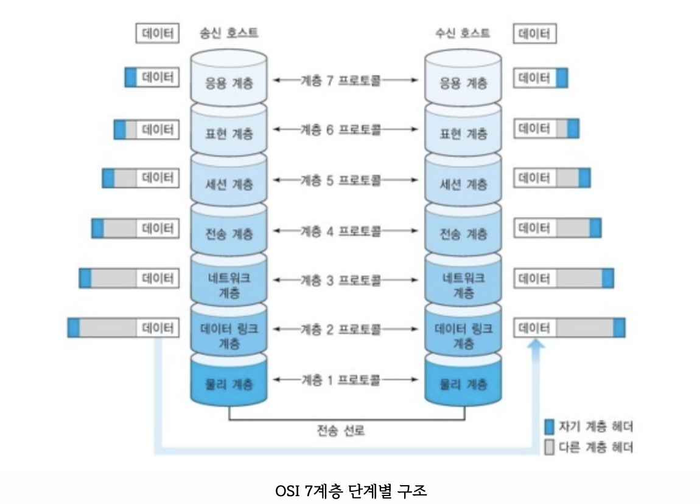
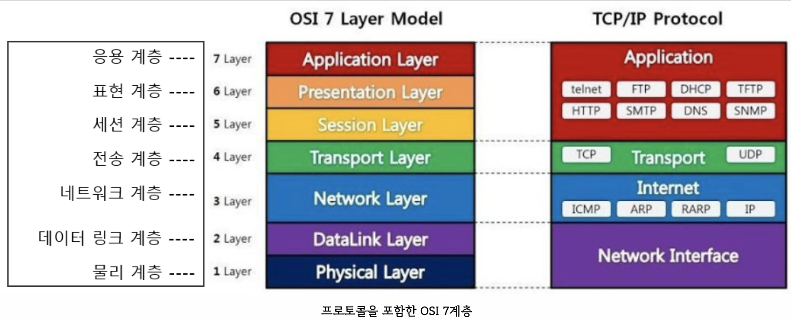

# OSI 7 Layer

OSI(Open Systems Interconnection) 7계층은 네트워크 통신의 기능과 프로토콜을 계층별로 분리하여 설계한 개방형 시스템 상호연결 참조 모델이다.

### OSI 7계층 단계별 구조

1. 물리 계층 (Physical Layer): 실제 장치를 연결하기 위한 전기적 및 물리적 세부 사항을 정의한 계층이다.
   인터넷 케이블, 라우터 스위치 등의 전기적 신호가 물리적인 장치에 의해 왔다 갔다(통신) 하는 계층이다.

2. 데이터 링크 계층 (Data Link Layer): 장치 간 신호를 전달하는 물리계층을 이용하여 네트워크 상의 주변 장치들 간의 데이터를 전송하는 역할을 한다.

3. 네트워크 계층 (Network Layer): 여러 개의 노드를 거칠 때마다 경로를 찾아주는 역할을 하는 계층으로 다양한 길이의 데이터를 네트워크들을 통해 전달하고, 그 과정에서 전송 계층이 요구하는 서비스 품질(QoS)을 제공하기 위한 기능적, 절차적 수단을 제공한다.

4. 전송 계층 (Transport Layer): 통신을 활성화하기 위한 계층이며 보통 TCP 프로토콜을 이용하며, 포트를 열어서 응용프로그램들이 전송을 할 수 있게 한다.

5. 세션 계층 (Session Layer): 통신 세션의 설정, 유지, 종료 등을 담당하며, 통신 장치 간의 동기화를 제공하고, 데이터 교환을 관리한다.

6. 표현 계층 (Presentation Layer): 데이터의 형식 변환, 암호화, 압축 등의 기능을 수행하여 응용 프로그램 간의 데이터 교환을 지원한다. 데이터를 일관성 있게 표현하고, 암호화하여 보안을 강화.

7. 응용 계층 (Application Layer): 최종 사용자에게 서비스를 제공하는 계층으로, 이메일, 파일 전송, 웹 브라우징 등 다양한 응용 프로그램과 사용자 인터페이스를 지원한다.

### 프로토콜을 포함한 OSI 7계층
