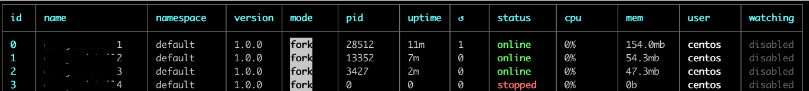
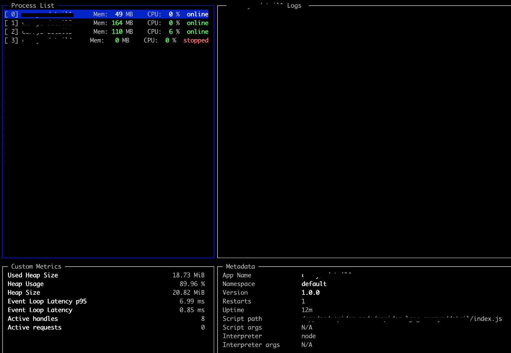

# PM2

PM2는 Node.js 어플리케이션을 쉽게 관리할 수 있게 해주는 Process Manager이다

서버에 Node.js 엔진을 올리기 위해 설치해서 사용했다.
Cluster모드가 있다고 하지만, 엔진을 어려개 다른서비스를 올려야해서 기본모드 fork로 사용했다.

### 서버에서 pm2 실행
해당 디렉토리에서
* npm init 
* npm install
* pm2 start index.js --name "my_service" --no-autorestart
    * 엔진을 crontab 마다 돌게끔 설정해놓았기 때문에 --no-autorestart 설정추가

### pm2 프로세스 확인용 
현재 운영중인엔진이라 엔진이름은 가렸다.
| $ pm2 list      |  $ pm2 monit |
| ---------- | ------------- 
| | | 

 