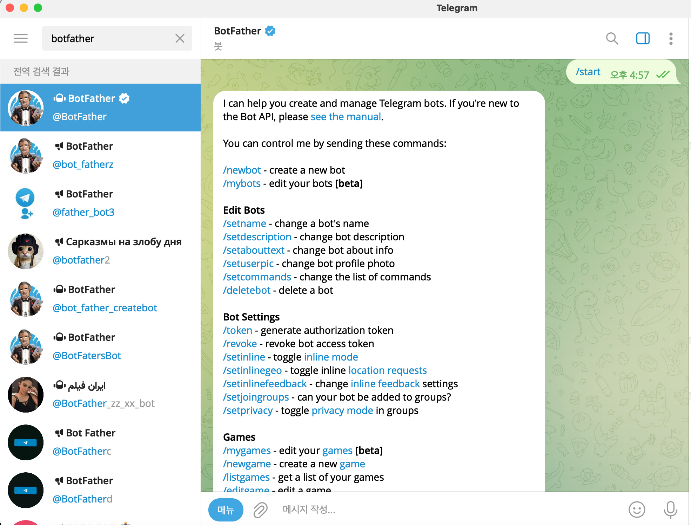
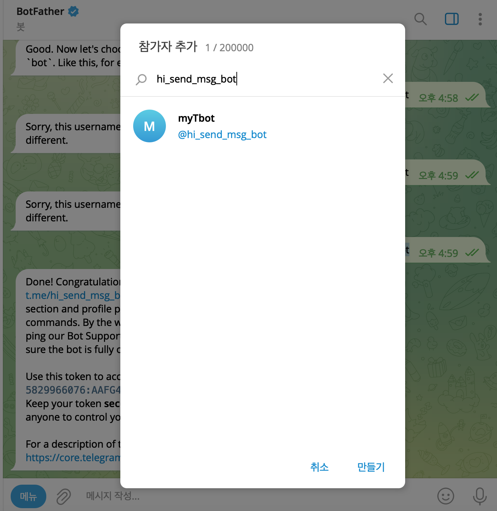

# telegram bot

## Install
telegram 설치

## Bot init
1. @BotFather 검색  
2. start 버튼클릭  
3. /newbot 입력  
4. 이름을 생성 => 중복가능
5. username => bot으로 끝나야하고 유니크한 값  
6. token, url  
7. url 클릭하여 봇 활성화  
* 

## Telegram그룹생성 후 Bot추가
> * 

* user id 가져오기
~~~
token = "봇의 토큰값"
method_name = "getUpdates"
url = 'https://api.telegram.org/bot{0}/{1}'.format(token,method_name)
~~~
> 그룹을 만들고 URL에 들어가면 chat_id가 나온다
* 해당 url들어가서 chat_id 가져오기
  * ID : "id":-717449850,
~~~json
{"ok":true,"result":[{"update_id":74952825,
"my_chat_member":{"chat":{"id":-717449850,"title":"hi_send_msg_bot","type":"group","all_members_are_administrators":true},"from":
....
~~~

## telegram.py

* 메세지 보내기
