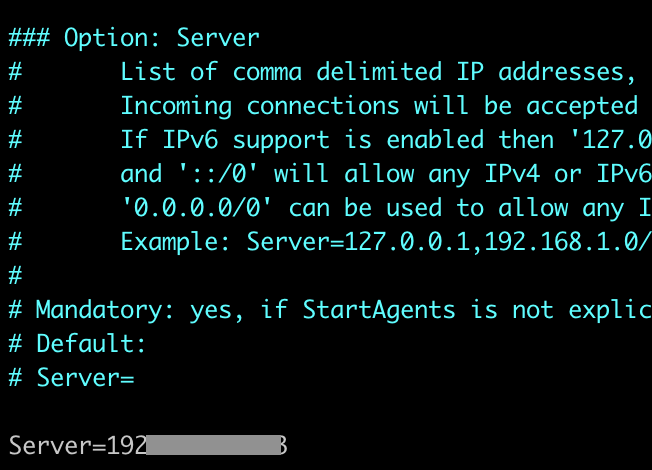
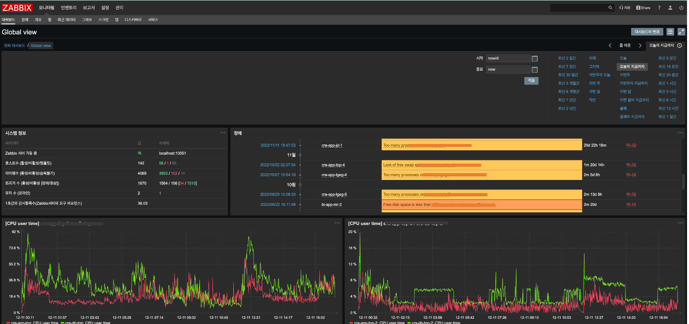
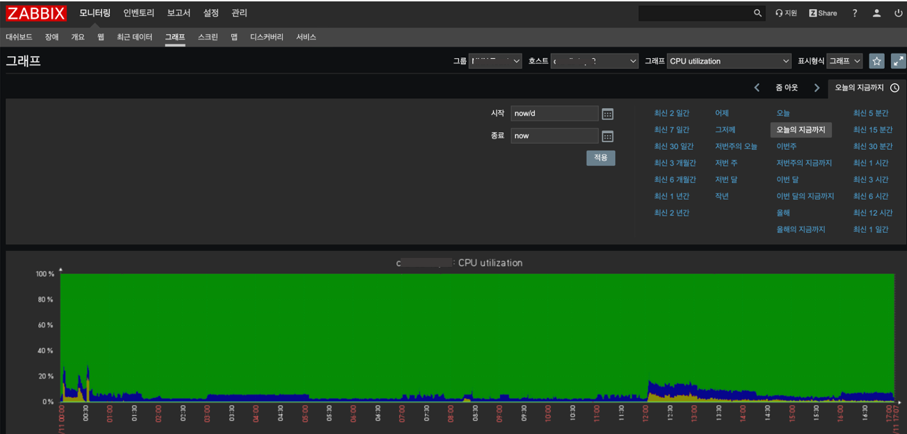

# Zabbix

회사에서 서버, 네트워크 업무를 볼때 유용한 시스템, 모니터링 시스템을 구축해서 장애가 생겼을 때 빠르게 대응할 수 있다는 장점이 있다.
- Zabbix는 유연한 알림 메커니즘을 갖추고 있어 사용자는 모든 이벤트에서 메일 기반 통지를 하도록 설정할 수 있다. 따라서, 이러한 기능을 통해 서버의 장애에 신속하게 대응할 수 있다.
- Zabbix는 저장된 데이터를 바탕으로 뛰어난 보고서 및 데이터의 그래픽 표시 기능을 제공
- Zabbix는 폴링과 트래핑을 모두 지원한다. Zabbix의 모든 보고서, 통계 및 구성 매개 변수는 웹 인터페이스를 통해 액세스할 수 있으며 웹 인터페이스는 어떤 장소에서도 액세스할 네트워크 나 서버의 상태를 확인할 수 있다.

## Zabbix 설치
### 1. zabbix 설치 확인
~~~sh
$ netstat -tnlp | grep zabbix
~~~

### 2. yum 저장소 update 및 Repository 추가

~~~
# centos 7
$ rpm -Uvh https://repo.zabbix.com/zabbix/4.0/rhel/7/x86_64/zabbix-release-4.0-2.el7.noarch.rpm
$
$ yum clean all
~~~

### 3. zabbix agent yum install
~~~
$ yum install -y zabbix-agent
~~~

### 4. zabbix-agent 시작
~~~
$ service zabbix-agent start

$ systemctl enable zabbix-agent

# Centos7에서 확인
$ systemctl list-unit-files | grep enabled | grep zabbix
~~~

### 5. 포트확인
~~~
netstat -tnlp | grep zabbix
~~~

### 6. Agent 파일 설정
~~~
vi /etc/zabbix/zabbix_agentd.conf
~~~
| 수정사항      |  예시         |
| ---------- | ------------- 
|Server=Zabbix Server IP (=132.226.231.171) |  Server=132.226.231.171| 
| ServerActive=Zabbix Server IP:10051 (=132.226.231.171) | ServerActive=132.226.231.171
| Hostname=(=client_Name) | Hostname=my-db (*Agent 의 HostName 을 입력. 서버에서 표시 될 Hostname)

* 

### 7. 자빅스 홈페이지에 추가하기
1.  자빅스 페이지에서 좌측 상단에 설정(Configuration) -> 호스트(하위메뉴)(Hosts) -> (우상단)호스트 작성(Create host)

2. Host 탭 (이미 등록되어있는것을 복제해서 수정가능.)
- host name, groups(select 버튼 이용, 지정한 group 선택), IP address(agent) 입력
3. Templates 탭
- Link new templates select 버튼 이용(Template OS Linux, Template DB MySQL) 선택

- 바로 밑 Add 버튼 클릭 후 Linked templates 추가 확인

### 8. active checks 확인
~~~
$ sudo systemctl restart zabbix-agent
$
$ tail -f /var/log/zabbix/zabbix_agentd.log
~~~

### 9. 자빅스 페이지에서 활성 확인

| 메인페이지      |  모니터링-그래프 (각 서버확인) |
| ---------- | ------------- 
| | | 

### 참고
 https://rainofpainki.github.io/zabbix_agent_for_centos/